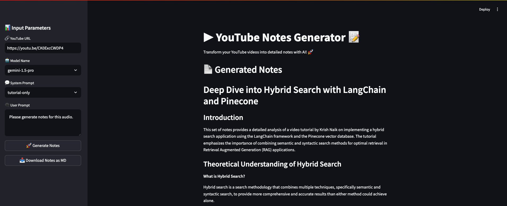

# YouTube Notes Generator

Generate detailed high quality and comprehensive notes from YouTube videos using Gemini-1.5-Pro or Gemini-1.5-Flash.

## 🚀 Features

- Generates comprehensive notes from YouTube videos
- Uses audio understanding instead of transcripts for better context
- Powered by state-of-the-art LLMs: gemini-1.5-pro or gemini-1.5-flash
- User-friendly interface built with Streamlit
- Two specialized system prompts:
   - TUTORIAL_ONLY: Allows to notes for tutorial based YouTube videos
   - CLASS_LECTURE: Allows to notes for academic lecture YouTube contents

## 🖼️ Screenshot



## 🛠️ Installation

1. Install ffmpeg:
   
   ```bash
   sudo apt-get install ffmpeg
   ```

2. Clone the repository:

   ```bash
   git clone https://github.com/di37/youtube-notes-generator.git
   cd youtube-notes-generator
   ```

3. Create and activate a Conda environment:

   ```bash
   conda create -n yt_notes_generator python=3.11
   conda activate yt_notes_generator
   ```

4. Install dependencies:
   ```bash
   pip install -r requirements.txt
   ```

## 🚀 Usage

1. Run the application:

   ```bash
   streamlit run app.py
   ```

2. Open your web browser and navigate to the URL provided by Streamlit (usually `http://localhost:8501`).

3. Enter a YouTube URL and click "Generate Notes" to create detailed notes for the video.

## 🤝 Contributing

Contributions are welcome! Feel free to submit a Pull Request.

## ⭐ Support

If you find this project useful, please consider giving it a star on GitHub!

## 📬 Contact

For any questions or feedback, please open an issue on GitHub.
